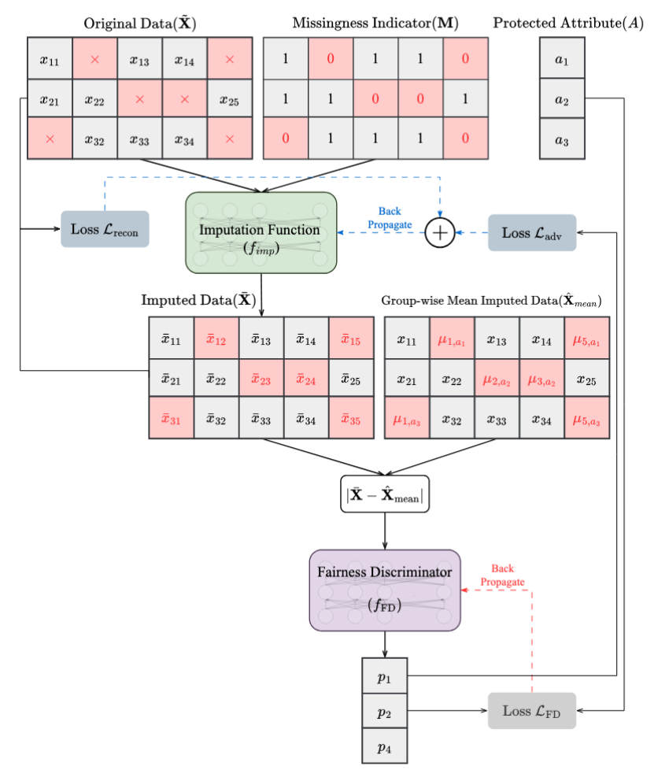

# FAIM: Fair Imputation with Adversarial Training for Mitigating Bias in Missing Data

The repository for the first **adversarially trained** **fair imputation** method. Our proposed method, **FAIM**, offers a general framework applicable to any gradient based imputation method that tunable fairness-accuracy trade-off that smoothly improves imputation and downstream fairness.

**FAIM Architecture.** The fairness discriminator  $f_{\text{FD}}$ learns to predict the protected attribute from imputation errors. The imputation function $f_{\text{imp}}$ is optimized with a combined reconstruction and adversarial loss to minimize group-identifiable signals and promote fairer imputations.

---
- Link to presentation: [Link]()
- Link to paper: [Link]()

The code will be added to this repository at a later time.
